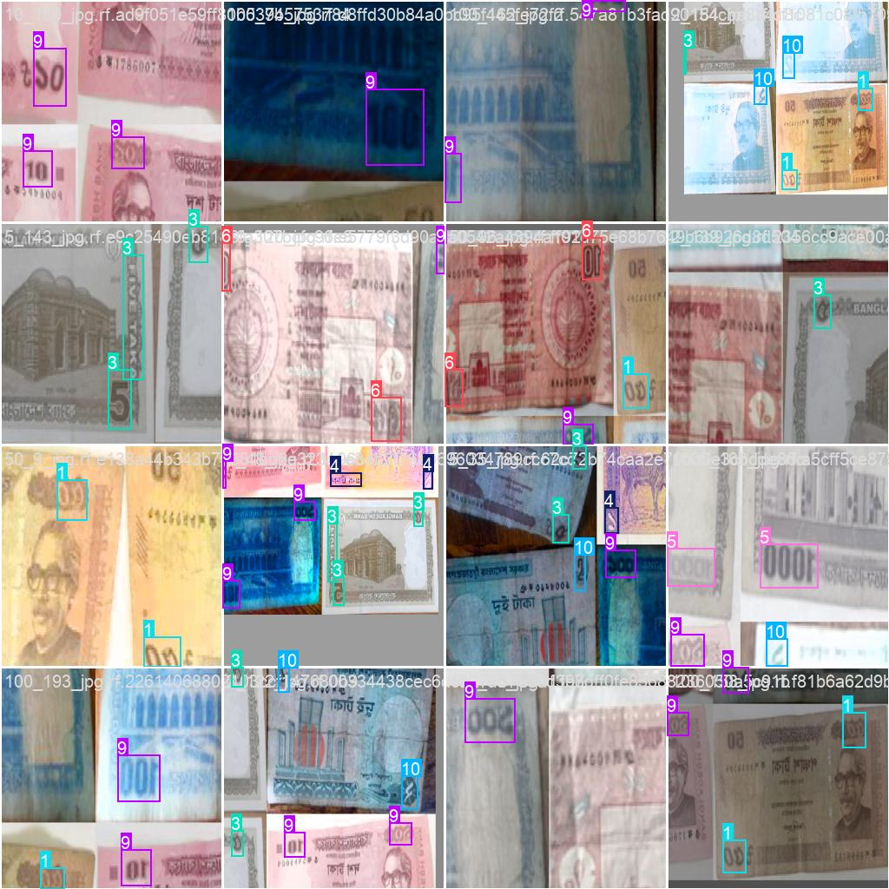
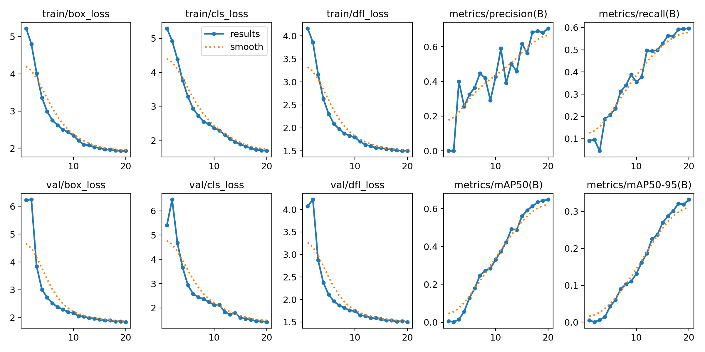
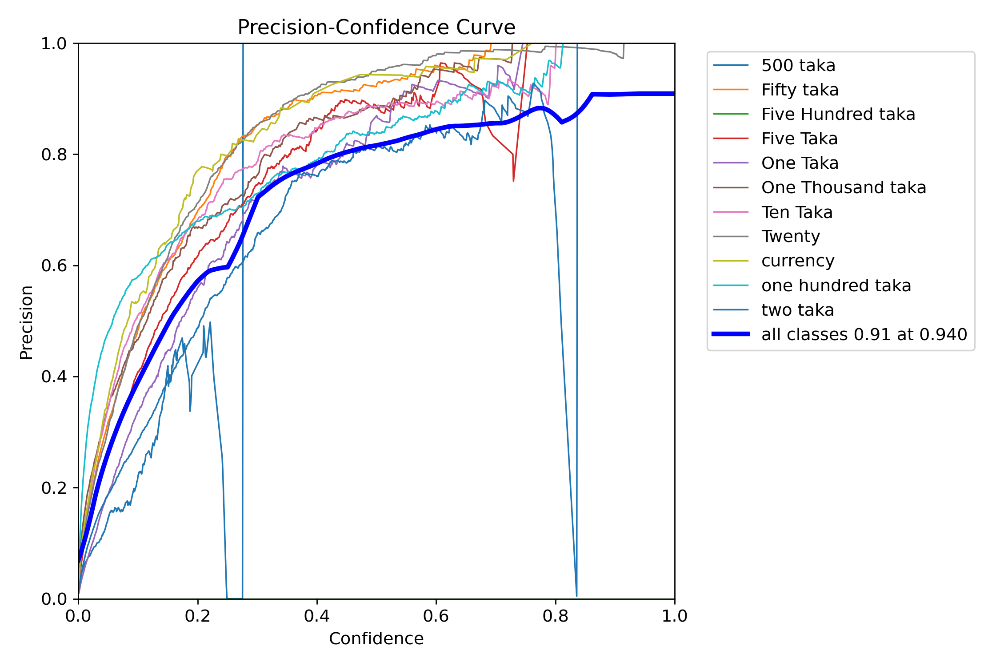
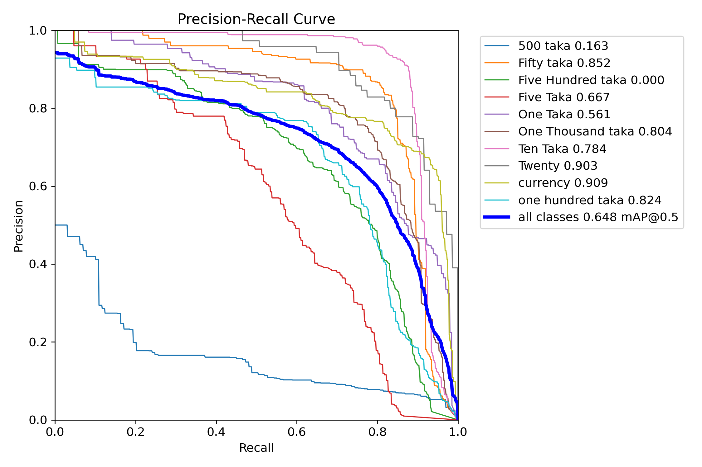
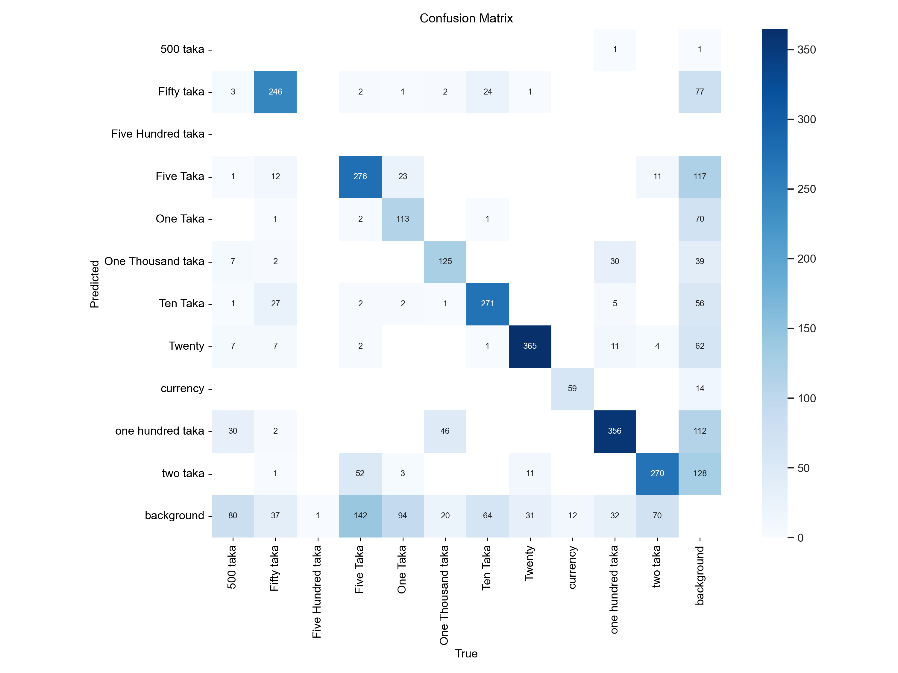
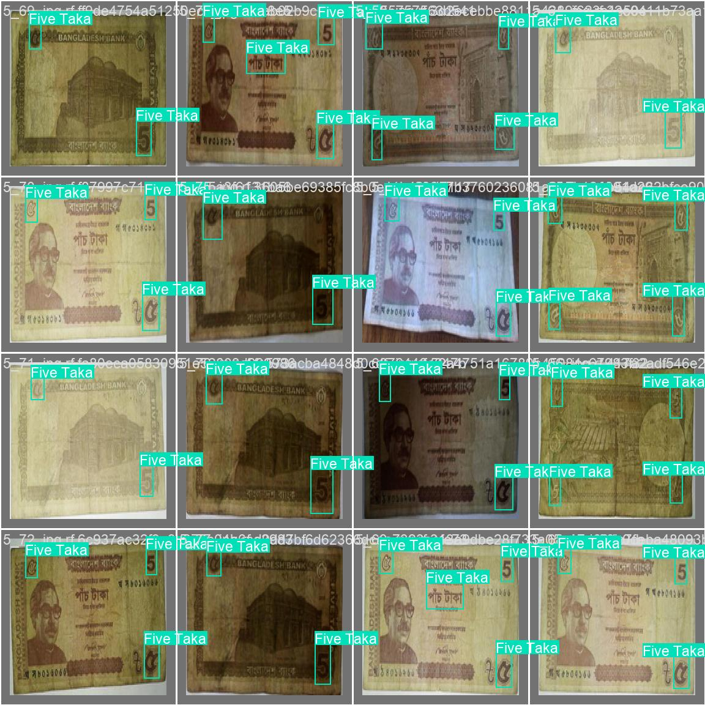
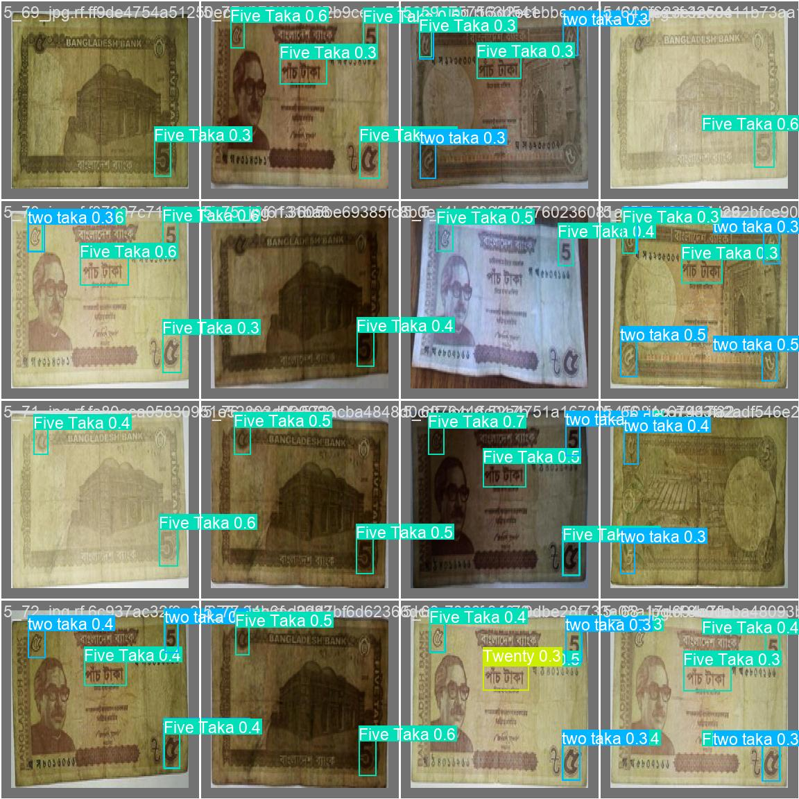

# Bangladeshi Currency Detection using YOLOv8

Real-time detection and classification of Bangladeshi Taka banknotes from a live webcam feed, with spoken audio feedback for accessibility. Built with a custom-trained YOLOv8 object detector.


<!--
  ADD YOUR DEMO HERE. Record a 10 to 15 second screen capture of the webcam
  window detecting a note, convert it to a GIF, save it to
  docs/assets/demo.gif, and this line will render it automatically.
-->


## Overview

This project trains a YOLOv8 object detection model to recognize Bangladeshi Taka notes (1 to 1000 Taka) from images or a live camera feed, then reads the detected denomination aloud using text to speech. It was built as a group project with accessibility in mind, helping visually impaired users identify currency notes independently.

Key features:

- Custom-trained YOLOv8 model on a hand-labeled dataset of Taka note images
- Real-time inference from a webcam with bounding box and confidence overlay
- Text to speech announcements of detected denominations, with cooldown logic to avoid repeating the same announcement every frame
- A secondary generic object detection demo (COCO classes) for pipeline testing without the custom weights
- Standalone evaluation script reporting mAP50, mAP50-95, precision, and recall on the validation set

## Tech Stack

| Component        | Tool |
|-------------------|------|
| Object detection  | YOLOv8 (Ultralytics) |
| Computer vision   | OpenCV |
| Text to speech    | pyttsx3 |
| Language          | Python 3.9+ |

## Project Structure

```
bd-currency-detection-yolov8/
├── src/
│   ├── train.py                   Train YOLOv8 on the currency dataset
│   ├── evaluate.py                Compute mAP, precision, recall
│   ├── detect_webcam_voice.py     Real-time detection plus TTS feedback
│   └── detect_webcam_generic.py   Generic COCO-class webcam demo
├── config.yaml                    Dataset and class definitions
├── weights/best.pt                Trained model weights
├── docs/                          Training/evaluation artifacts and results.csv
├── requirements.txt
├── LICENSE
└── README.md
```

## Dataset

The model is trained on a custom-labeled dataset of Bangladeshi Taka note images covering 11 defined classes (1, 2, 5, 10, 20, 50, 100, 500, and 1000 Taka, plus a duplicate "500 Taka" style class and an "unclassified currency" catch-all; see Limitations below). Images were annotated in YOLO format, one text file per image with class, x center, y center, width, height.

Class distribution and bounding box statistics across the training set:


A batch of training images with their ground truth boxes:



The raw dataset is not included in this repo due to size. If you are reproducing this project, organize your images as:

```
data/currency/train/images, data/currency/train/labels
data/currency/test/images,  data/currency/test/labels
```

and update the paths in config.yaml accordingly.

## Results

Trained for 20 epochs on CPU. Final validation metrics (see docs/results.csv for the full per-epoch log):

| Metric       | Score  |
|--------------|--------|
| Precision    | 0.706  |
| Recall       | 0.596  |
| mAP@0.5      | 0.648  |
| mAP@0.5:0.95 | 0.332  |
| F1 (best)    | 0.60 at confidence 0.283 |

Training curves (loss and metrics over all 20 epochs):



Precision, Recall, F1, and PR curves per class:

| Precision-Confidence | Recall-Confidence |
|---|---|
|  |  |




Confusion matrices (raw counts and row-normalized):

| Confusion Matrix | Confusion Matrix (Normalized) |
|---|---|
|  |  |

Sample predictions vs. ground truth on a held-out validation batch (left: ground truth, right: model predictions with confidence scores):

| Ground Truth | Predictions |
|---|---|
|  |  |

## Limitations and Honest Notes

This is a learning project, and the evaluation artifacts above tell an honest story that is worth stating plainly rather than glossing over.

- Per-class performance is very uneven. Common, high-contrast notes detect well: Twenty (0.90 AP), currency-generic (0.91 AP), Fifty (0.85 AP). Two classes perform very poorly: "500 taka" (0.163 AP) and "Five Hundred taka" (0.000 AP).
- The class distribution chart confirms why: "Five Hundred taka" has effectively zero labeled instances in the training set, so the model never had anything to learn from it, and the confusion matrix shows its true column is essentially empty.
- "500 taka" does have around 130 training instances, but the confusion matrix shows the model almost never predicts it correctly. Its true instances are most often confused with "one hundred taka" (30 cases) or missed as background (80 cases), which points to strong visual similarity between the two notes plus an actual class-definition overlap: "500 taka" and "Five Hundred taka" almost certainly refer to the same physical note under two different labels, splitting an already small amount of training signal.
- "two taka" and "one taka" also show weaker recall and more background confusion than the top-performing classes.
- Likely causes: overlapping and duplicate class definitions (see config.yaml), class imbalance (some classes have under 100 instances, others have over 400, per the distribution chart), and visually similar or worn notes that are genuinely hard to separate even by eye.
- Fix before relying on this for anything real: merge or relabel the duplicate 500-taka classes, rebalance or augment underrepresented classes, and re-run evaluation to confirm the AP for those classes actually improves.
- Trained on CPU for only 20 epochs. A GPU and more epochs would likely close much of this gap.

Calling this out is not a weakness in the writeup. It demonstrates the ability to read confusion matrices and per-class curves critically instead of only reporting the headline mAP number.

## Getting Started

### 1. Clone and install dependencies

```bash
git clone https://github.com/<your-username>/bd-currency-detection-yolov8.git
cd bd-currency-detection-yolov8
pip install -r requirements.txt
```

### 2. (Optional) Train from scratch

A trained checkpoint is already included at weights/best.pt, so you can skip straight to step 3 or 4. To retrain from scratch instead:

```bash
python src/train.py --data config.yaml --epochs 80 --imgsz 640 --device cpu
```

Trained weights are saved to runs/detect/train/weights/best.pt. Copy the final weights to weights/best.pt to use them with the other scripts.

### 3. Evaluate

```bash
python src/evaluate.py --weights weights/best.pt --data config.yaml
```

### 4. Run real-time detection with voice feedback

```bash
python src/detect_webcam_voice.py --weights weights/best.pt --camera 0
```

Press q to quit the webcam window.

## Future Improvements

- Fix the duplicate 500-taka class labels and rebalance underrepresented classes, then retrain
- Expand the dataset with more lighting conditions, note wear, and angles
- Deploy as a lightweight mobile app (for example TFLite or ONNX export) for offline, on-device use
- Multi-currency support
- Fine-grained detection of counterfeit indicators

## Acknowledgments

Built as a group university project exploring applied computer vision for accessibility. Powered by Ultralytics YOLOv8.

## License

Released under the MIT License. See LICENSE.
